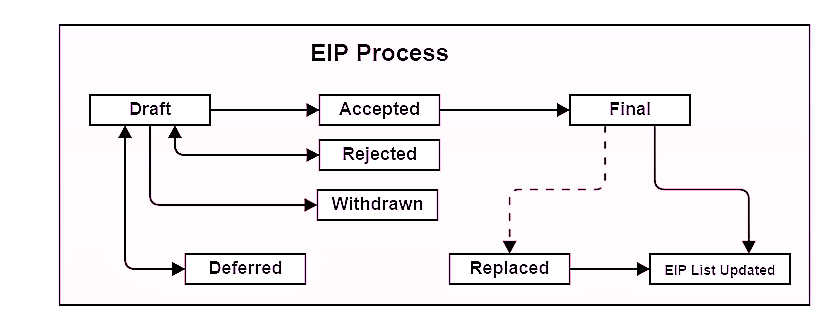

What is a PIP?
--------------

PIP stands for Peercoin Improvement Proposal. A PIP is a design document providing information to the Peercoin community, or describing a new feature for Peercoin or its processes or environment. The PIP should provide a concise technical specification of the feature and a rationale for the feature. The PIP author is responsible for building consensus within the community and documenting dissenting opinions.

PIP Rational
------------

We intend PIPs to be the primary mechanisms for proposing new features, for collecting community input on an issue, and for documenting the design decisions that have gone into Peercoin. Because the PIPs are maintained as text files in a versioned repository, their revision history is the historical record of the feature proposal.

For Peercoin implementers, PIPs are a convenient way to track the progress of their implementation. Ideally each implementation maintainer would list the PIPs that they have implemented. This will give end users a convenient way to know the current status of a given implementation or library.

PIP Types
---------

There are three types of PIP:

-   A **Standard Track PIP** describes any change that affects most or all Peercoin implementations, such as a change to the the network protocol, a change in block or transaction validity rules, proposed application standards/conventions, or any change or addition that affects the interoperability of applications using Peercoin. Furthermore Standard PIPs can be broken down into the following categories.
    -   **Core** - improvements requiring a consensus fork, as well as changes that are not necessarily consensus critical but may be relevant to “core dev” discussions.
    -   **Interface** - includes improvements around client [API/RPC] specifications and standards, and also certain language-level standards like method names and [contract ABIs]. The label “interface” aligns with the [interfaces repo] and discussion should primarily occur in that repository before a PIP is submitted to the PIPs repository.
-   An **Informational PIP** describes a Peercoin design issue, or provides general guidelines or information to the Peercoin community, but does not propose a new feature. Informational PIPs do not necessarily represent Peercoin community consensus or a recommendation, so users and implementers are free to ignore Informational PIPs or follow their advice.
-   A **Meta PIP** describes a process surrounding Peercoin or proposes a change to (or an event in) a process. Process PIPs are like Standards Track PIPs but apply to areas other than the Peercoin protocol itself. They may propose an implementation, but not to Peercoin's codebase; they often require community consensus; unlike Informational PIPs, they are more than recommendations, and users are typically not free to ignore them. Examples include procedures, guidelines, changes to the decision-making process, and changes to the tools or environment used in Peercoin development. Any meta-PIP is also considered a Process PIP.

PIP Work Flow
-------------

The PIP repository Collaborators change the PIPs status. Please send all PIP-related email to the PIP Collaborators, which is listed under PIP Editors below. Also see PIP Editor Responsibilities & Workflow.

The PIP process begins with a new idea for Peercoin. It is highly recommended that a single PIP contain a single key proposal or new idea. The more focused the PIP, the more successful it tends to be. A change to one client doesn't require a PIP; a change that affects multiple clients, or defines a standard for multiple apps to use, does. The PIP editor reserves the right to reject PIP proposals if they appear too unfocused or too broad. If in doubt, split your PIP into several well-focused ones.

Each PIP must have a champion - someone who writes the PIP using the style and format described below, shepherds the discussions in the appropriate forums, and attempts to build community consensus around the idea.

Vetting an idea publicly before going as far as writing a PIP is meant to save the potential author time. Asking the Peercoin community first if an idea is original helps prevent too much time being spent on something that is guaranteed to be rejected based on prior discussions (searching the Internet does not always do the trick). It also helps to make sure the idea is applicable to the entire community and not just the author. Just because an idea sounds good to the author does not mean it will work for most people in most areas where Peercoin is used. Examples of appropriate public forums to gauge interest around your PIP include [the Peercoin subreddit], [the Issues section of this repository], and [one of the Peercoin Gitter chat rooms]. In particular, [the Issues section of this repository] is an excellent place to discuss your proposal with the community and start creating more formalized language around your PIP.

Once the champion has asked the Peercoin community whether an idea has any chance of acceptance a draft PIP should be presented as a [pull request]. This gives the author a chance to continuously edit the draft PIP for proper formatting and quality. This also allows for further public comment and the author of the PIP to address concerns about the proposal.

If the PIP collaborators approve, the PIP editor will assign the PIP a number (generally the issue or PR number related to the PIP), label it as Standards Track, Informational, or Meta, give it status “Draft”, and add it to the git repository. The PIP editor will not unreasonably deny a PIP. Reasons for denying PIP status include duplication of effort, being technically unsound, not providing proper motivation or addressing backwards compatibility, or not in keeping with the Peercoin philosophy.

Standards Track PIPs consist of three parts, a design document, implementation, and finally if warranted an update to the [formal specification]. The PIP should be reviewed and accepted before an implementation is begun, unless an implementation will aid people in studying the PIP. Standards Track PIPs must be implemented in at least three viable Peercoin clients before it can be considered Final.

For a PIP to be accepted it must meet certain minimum criteria. It must be a clear and complete description of the proposed enhancement. The enhancement must represent a net improvement. The proposed implementation, if applicable, must be solid and must not complicate the protocol unduly.

Once a PIP has been accepted, the implementations must be completed. When the implementation is complete and accepted by the community, the status will be changed to “Final”.

A PIP can also be assigned status “Deferred”. The PIP author or editor can assign the PIP this status when no progress is being made on the PIP. Once a PIP is deferred, the PIP editor can re-assign it to draft status.

A PIP can also be “Rejected”. Perhaps after all is said and done it was not a good idea. It is still important to have a record of this fact.

PIPs can also be superseded by a different PIP, rendering the original obsolete.

The possible paths of the status of PIPs are as follows:

Some Informational and Process PIPs may also have a status of “Active” if they are never meant to be completed. E.g. PIP 001 (this PIP).

What belongs in a successful PIP?
---------------------------------

Each PIP should have the following parts:

-   Preamble - RFC 822 style headers containing metadata about the PIP, including the PIP number, a short descriptive title (limited to a maximum of 44 characters), the names, and optionally the contact info for each author, etc.

<!-- -->

-   Simple Summary - “If you can’t explain it simply, you don’t understand it well enough.” Provide a simplified and layman-accessible explanation of the PIP.

<!-- -->

-   Abstract - a short (~200 word) description of the technical issue being addressed.

<!-- -->

-   Motivation (*optional) - The motivation is critical for PIPs that want to change the Peercoin protocol. It should clearly explain why the existing protocol specification is inadequate to address the problem that the PIP solves. PIP submissions without sufficient motivation may be rejected outright.

<!-- -->

-   Specification - The technical specification should describe the syntax and semantics of any new feature. The specification should be detailed enough to allow competing, interoperable implementations for any of the current Peercoin platforms (cpp-Peercoin, go-Peercoin, parity, PeercoinJ, Peercoinjs-lib, …).

<!-- -->

-   Rationale - The rationale fleshes out the specification by describing what motivated the design and why particular design decisions were made. It should describe alternate designs that were considered and related work, e.g. how the feature is supported in other languages. The rationale may also provide evidence of consensus within the community, and should discuss important objections or concerns raised during discussion.

<!-- -->

-   Backwards Compatibility - All PIPs that introduce backwards incompatibilities must include a section describing these incompatibilities and their severity. The PIP must explain how the author proposes to deal with these incompatibilities. PIP submissions without a sufficient backwards compatibility treatise may be rejected outright.

<!-- -->

-   Test Cases - Test cases for an implementation are mandatory for PIPs that are affecting consensus changes. Other PIPs can choose to include links to test cases if applicable.

<!-- -->

-   Implementations - The implementations must be completed before any PIP is given status “Final”, but it need not be completed before the PIP is accepted. While there is merit to the approach of reaching consensus on the specification and rationale before writing code, the principle of “rough consensus and running code” is still useful when it comes to resolving many discussions of API details.

<!-- -->

-   Copyright Waiver - All PIPs must be in public domain. See the bottom of this PIP for an example copyright waiver.

PIP Formats and Templates
-------------------------

PIPs should be written in [markdown] format. Image files should be included in a subdirectory for that PIP.

PIP Header Preamble
-------------------

Each PIP must begin with an RFC 822 style header preamble, preceded and followed by three hyphens ('---'). The headers must appear in the following order. Headers marked with "*" are optional and are described below. All other headers are required.

` pip: ` <PIP number> (this is determined by the PIP editor)

` title: `<PIP title>

` author: `<list of author's real names and optionally, email address>

` * discussions-to: ` <email address>

` status: `<Draft | Active | Accepted | Deferred | Rejected | Withdrawn | Final | Superseded>

` type: `<Standards Track (Core or Interface)  | Informational | Meta>

` * category `: <Core | Interface>

` created: `<date created on, in ISO 8601 (yyyy-mm-dd) format>

` * requires: `<PIP number(s)>

` * replaces: `<PIP number(s)>

` * superseded-by: `<PIP number(s)>

` * resolution: `<url>

The author header lists the names, and optionally the email addresses of all the authors/owners of the PIP. The format of the author header value must be

Random J. User &lt;address@dom.ain&gt;

if the email address is included, and

Random J. User

if the email address is not given.

Note: The resolution header is required for Standards Track PIPs only. It contains a URL that should point to an email message or other web resource where the pronouncement about the PIP is made.

While a PIP is in private discussions (usually during the initial Draft phase), a discussions-to header will indicate the mailing list or URL where the PIP is being discussed. No discussions-to header is necessary if the PIP is being discussed privately with the author.

The type header specifies the type of PIP: Standards Track, Meta, or Informational. If the track is Standards please include the subcategory (core, networking, interface, or ERC).

The category header specifies the PIP's category. This is required for standards-track PIPs only.

The created header records the date that the PIP was assigned a number. Both headers should be in yyyy-mm-dd format, e.g. 2001-08-14.

PIPs may have a requires header, indicating the PIP numbers that this PIP depends on.

PIPs may also have a superseded-by header indicating that a PIP has been rendered obsolete by a later document; the value is the number of the PIP that replaces the current document. The newer PIP must have a Replaces header containing the number of the PIP that it rendered obsolete.

Headers that permit lists must separate elements with commas.

Auxiliary Files
---------------

PIPs may include auxiliary files such as diagrams. Such files must be named PIP-XXXX-Y.ext, where “XXXX” is the PIP number, “Y” is a serial number (starting at 1), and “ext” is replaced by the actual file extension (e.g. “png”).

Transferring PIP Ownership
--------------------------

It occasionally becomes necessary to transfer ownership of PIPs to a new champion. In general, we'd like to retain the original author as a co-author of the transferred PIP, but that's really up to the original author. A good reason to transfer ownership is because the original author no longer has the time or interest in updating it or following through with the PIP process, or has fallen off the face of the 'net (i.e. is unreachable or not responding to email). A bad reason to transfer ownership is because you don't agree with the direction of the PIP. We try to build consensus around a PIP, but if that's not possible, you can always submit a competing PIP.

If you are interested in assuming ownership of a PIP, send a message asking to take over, addressed to both the original author and the PIP editor. If the original author doesn't respond to email in a timely manner, the PIP editor will make a unilateral decision (it's not like such decisions can't be reversed :).

PIP Editors
-----------

The current PIP editors are

` * Casey Detrio (@cdetrio)`

` * Hudson Jameson (@Souptacular)`

` * Martin Becze (@wanderer)`

` * Nick Johnson (@arachnid)`

` * Vitalik Buterin (@vbuterin)`

` * Nick Savers (@nicksavers)`

PIP Editor Responsibilities and Workflow
--------------------------------------

For each new PIP that comes in, an editor does the following:

-   Read the PIP to check if it is ready: sound and complete. The ideas must make technical sense, even if they don't seem likely to be accepted.
-   The title should accurately describe the content.
-   Edit the PIP for language (spelling, grammar, sentence structure, etc.), markup (Github flavored Markdown), code style

If the PIP isn't ready, the editor will send it back to the author for revision, with specific instructions.

Once the PIP is ready for the repository, the PIP editor will:

-   Assign a PIP number (generally the PR number or, if preferred by the author, the Issue # if there was discussion in the Issues section of this repository about this PIP)

<!-- -->

-   Accept the corresponding pull request

<!-- -->

-   Send a message back to the PIP author with next step.

Many PIPs are written and maintained by developers with write access to the Peercoin codebase. The PIP editors monitor PIP changes, and correct any structure, grammar, spelling, or markup mistakes we see.

The editors don't pass judgment on PIPs. We merely do the administrative & editorial part.

History
-------

PIP Rules Master is forked from 

This document was derived heavily from [Bitcoin's BIP-0001] written by Amir Taaki which in turn was derived from [Python's PEP-0001]. In many places text was simply copied and modified. Although the PEP-0001 text was written by Barry Warsaw, Jeremy Hylton, and David Goodger, they are not responsible for its use in the Peercoin Improvement Process, and should not be bothered with technical questions specific to Peercoin or the PIP. Please direct all comments to the PIP editors.

3 April 2018: PIP 001 Proposed

  [the Peercoin subreddit]: https://www.reddit.com/r/Peercoin/
  [pull request]: https://github.com/MattLongCT/PIPs/pulls
  [formal specification]: https://github.com/Peercoin/yellowpaper
  [the Issues section of this repository]: https://github.com/MattLonCT/PIPs/issues
  [markdown]: https://github.com/adam-p/markdown-here/wiki/Markdown-Cheatsheet
  [Ethereum's EIP-0001]: https://github.com/ethereum/EIPs
  [Bitcoin's BIP-0001]: https://github.com/bitcoin/bips
  [Python's PEP-0001]: https://www.python.org/dev/peps/

Copyright
---------

--
